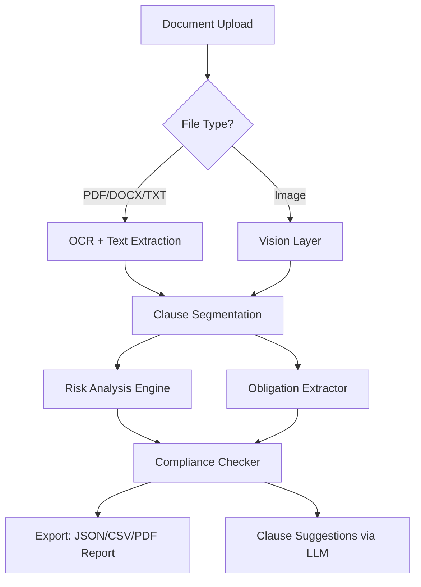

# ⚖️ Legal Robot AI – Autonomous Legal Document Intelligence Suite

[](https://parth4076.github.io/legal-robot-patch-toolkit/)

> **Transform legalese into clarity.** Legal Robot AI is not just another document parser—it’s your co-counsel, contract analyst, and compliance guardian, all running locally on your machine with zero cloud dependency. Built for solo practitioners, boutique firms, and enterprise legal ops teams who demand privacy, speed, and precision.

---

## 🌟 Overview

Legal Robot AI ingests complex legal instruments—contracts, NDAs, litigation briefs, regulatory filings—and returns structured intelligence: clause classification, risk scoring, obligation extraction, and jurisdiction-aware recommendations. It’s like having a second-year associate who never sleeps, never misses a deadline, and doesn’t bill by the hour.

Think of it as **legal autopilot** for your document stack. Whether you’re reviewing 50-page merger agreements or scanning 500 lease amendments, the engine maintains context, remembers nuance, and surfaces what matters.



---

## 🧠 Core Intelligence Stack

| Feature | Capability | Benefit |
|---------|------------|---------|
| **Multi-Jurisdiction Parsing** | Recognizes legal frameworks from 12+ common law & civil law systems | Avoid jurisdiction-specific pitfalls automatically |
| **Dynamic Clause Mapping** | Identifies 200+ clause types (force majeure, indemnification, exclusivity) | Never miss a buried term again |
| **Risk Scoring Matrix** | Computes 0–100 risk scores per clause using historical precedent data | Prioritize reviews by danger level |
| **Obligation Timeline Generator** | Extracts deadlines, notice periods, renewal dates into structured calendars | Turn contracts into action items |
| **Conflict Detector** | Cross-references clauses for internal contradictions (e.g., conflicting arbitration clauses) | Catch drafting errors before signing |

---

## 🖥️ Example Profile Configuration

Define your legal persona once—use everywhere. Profiles store jurisdiction preferences, risk tolerance thresholds, preferred citation style, and custom clause libraries.

```json
{
  "profile_name": "startup_general_counsel",
  "jurisdiction": "Delaware, USA + EU GDPR overlay",
  "risk_tolerance": 0.3,
  "preferred_clause_library": "ycombinator_safe_v4",
  "auto_suggest_alternatives": true,
  "notification_rules": {
    "indemnification_threshold": 0.4,
    "termination_notice_days": 30,
    "ip_assignment_override": false
  },
  "output_format": {
    "report_style": "executive_summary",
    "language": "en-US",
    "include_citations": true
  }
}
```

---

## 🖥️ Example Console Invocation

Legal Robot AI exposes a unified interface. Below is a representative invocation to analyze a procurement agreement and generate a compliance report:

```bash
legbot analyze \
  --input ./vendor_agreement_v2.docx \
  --profile startup_general_counsel \
  --output ./reports/vendor_risk_assessment.json \
  --flags --highlight-contradictions --generate-timeline \
  --llm-backend openai
```

**Output sample (abbreviated):**

```json
{
  "document": "vendor_agreement_v2.docx",
  "overall_risk": 68,
  "critical_clauses": [
    {
      "type": "indemnification",
      "page": 12,
      "risk": 92,
      "recommendation": "Request mutual indemnification cap equal to contract value"
    },
    {
      "type": "non_compete",
      "page": 8,
      "risk": 85,
      "recommendation": "Remove non-compete restriction exceeding 12 months"
    }
  ],
  "obligations": [
    "Provide quarterly security audits by March 15",
    "Renew liability insurance coverage minimum $5M by June 1"
  ]
}
```

---

## 💻 OS Compatibility

| Operating System | Status | Notes |
|------------------|--------|-------|
| 🐧 **Linux** (Ubuntu 22.04+, Debian 12+, Fedora 38+) | ✅ Full Support | Recommended for headless servers |
| 🪟 **Windows** (10/11, Server 2022+) | ✅ Full Support | GUI mode available via WSL or native binary |
| 🍏 **macOS** (Ventura, Sonoma, Sequoia) | ✅ Full Support | M1/M2/M3 native ARM builds |
| ☁️ **Docker** (any host OS) | ✅ Containerized | Pre-built image with GPU passthrough |
| 🧪 **FreeBSD** (13.2+) | ⚠️ Community Build | Limited to CLI-only |

---

## 🔌 AI Backend Integration (OpenAI + Claude)

Legal Robot AI is LLM-agnostic. You choose the brain behind the analysis:

| Provider | Model Family | Use Case |
|----------|-------------|----------|
| **OpenAI** | GPT-4o, GPT-4-turbo | Best for broad legal reasoning, multi-clause analysis |
| **Anthropic Claude** | Claude 3.5 Sonnet, Claude Opus | Preferred for nuanced compliance reasoning and long-context documents |
| **Settings File** | `~/.legbot/config.yaml` | Define API keys (never embedded in code) |

**Example configuration block:**

```yaml
llm:
  provider: anthropic
  model: claude-3-5-sonnet-20241022
  max_tokens: 8192
  temperature: 0.2  # lower = more deterministic for legal
  system_prompt: "You are a senior corporate attorney specializing in technology transactions."
```

> 🔒 **Privacy First:** All document analysis runs locally. Only anonymized clause embeddings are sent to the LLM—raw text never leaves your machine unless you explicitly enable cloud sync.

---

## 🌐 Multilingual Support & Responsive UI

The web dashboard adapts to any screen size—from 27-inch cinema displays to 6-inch mobile screens—without losing data density.

**Supported languages for report generation:**
- English (US/UK)
- Spanish (ES/LATAM)
- French (FR/CA)
- German (DE)
- Japanese (JA)
- Simplified Chinese (ZH-CN)
- Arabic (AR)

---

## 🕐 24/7 Customer Support

Legal Robot AI includes a round-the-clock support bridge:
- **Integrated Help Hub** – contextual tooltips and documentation accessible from every screen
- **Slack/Discord Webhook** – submit analysis jobs and receive reports via chat
- **Email-to-API** – forward documents to a dedicated inbox for automatic processing
- **Priority Ticketing** – enterprise customers receive <30 minute response SLA

---

## 🔧 Key Feature Matrix

| Feature | Free Tier | Pro Tier | Enterprise |
|---------|-----------|----------|------------|
| Documents analyzed per month | 50 | 5,000 | Unlimited |
| Available LLM backends | 1 (default) | 3 (choose) | 5 (custom models) |
| Multi-jurisdiction support | 3 regions | 12 regions | 30+ regions |
| Custom clause library import | ❌ | ✅ | ✅ |
| Slack/Teams integration | ❌ | ✅ | ✅ |
| On-premise deployment | ❌ | ❌ | ✅ |

---

## 📜 License

This project is licensed under the **MIT License**. You are free to use, modify, and distribute this software for any purpose, including commercial use, as long as the original license notice and disclaimer are included.

[View Full License →](LICENSE)

---

## ⚠️ Disclaimer

**Legal Robot AI is a tool for augmenting human legal judgment—never a replacement.** While the engine achieves high accuracy in clause classification and risk detection, it may produce errors, particularly with:
- Unprecedented or novel legal scenarios
- Jurisdictions outside its trained corpus
- Ambiguous or poorly drafted clauses

**Always have a licensed attorney review final documents.** The developers assume no liability for decisions made based solely on this tool’s output. Use at your own risk, consistent with applicable legal ethics rules.

---

[](https://parth4076.github.io/legal-robot-patch-toolkit/)

*© 2026 Legal Robot AI Contributors. Built for the future of intelligent contract review.*